# AlembicX

## Overview  
A library for testing Alembic migrations

## Quickstart  
```bash  
pip install AlembicX  
```  

## Architecture  

```mermaid  
flowchart TD
    subgraph Legend["Project colors"]
        direction TB
        py[Python]:::python
        rs[Rust]:::rust
        err[Error]:::handler
        cl[CLI]:::cli
    end

    %% Python
    subgraph Python["Python-part."]
        A[Pytest CLI]:::cli -->|"--test-async-alembic"| B(Pytest Plugin):::python
        B -->|Create| C[AsyncAlembicRunner]:::python
        C -->|Using| D[AsyncEngine]:::python
        C -->|Reading| E[AlembicConfig]:::python

        C -.-> ErrorBus
        D -.-> ErrorBus
        E -.-> ErrorBus
    end

    %% Rust
    subgraph Rust["Rust-magic."]
        F[VPS Controller]:::rust -->|FFI| B
        F --> G[IP Reader]:::rust
        G --> H[User IP<br>+<br>User IP changers check]:::rust
        F --> I[DataBase Manager]:::rust
        I --> J[Grant Privileges]:::rust
        I --> K[Create Schema]:::rust
        I --> L[Edit pg_hba.conf]:::rust
        
        F -.-> ErrorBus
        G -.-> ErrorBus
        I -.-> ErrorBus
    end

    %% Error-handler
    subgraph Handler["Error-handler."]
        exc[Exception]:::handler -->|Log| M[Logger]:::handler
        exc -->|Alert| N[Telegram ?]:::handler
    end

    %% Groups bonds
    B --> |Call| F
    L --> |CIDR Rules| H

    %% Error Bus
    ErrorBus(("Error Bus<br>(central router)")):::error
    ErrorBus --> Handler[[Error Handler]]

   %% Styles
    classDef python fill:#4584b6,stroke:#000079;
    classDef rust fill:#ce412b,stroke:#b00000;
    classDef cli fill:#000050,stroke:#fff,color:#fff
    classDef error_bus fill:#ff9800,stroke:#000,stroke-width:2px;
    classDef handler fill:#4c4f41,stroke:#000;
    
    linkStyle 4,5,6,14,15,16 stroke:#ff9800,stroke-width:2px,stroke-dasharray:3,opacity:0.5;
```  


### Key Components  
| Component            | Description                           |  
|----------------------|---------------------------------------|  
| `AsyncAlembicRunner` | Start migrations via SQLAlchemy v.2.0 |  
| `VPS Controller`     | Auto-configure VPS via Rust           |  
| `Error Bus`          | Centralized Error Handling            |  

## Roadmap  
- [x] Design architecture
- [ ] Implement Python core (MVP)
- [ ] Add Error Bus system
- [ ] Integrate Rust VPS controller

## Warning  
This project may contain traces of **over-engineering** and **Rust fanboyism**. Use with caution!  
